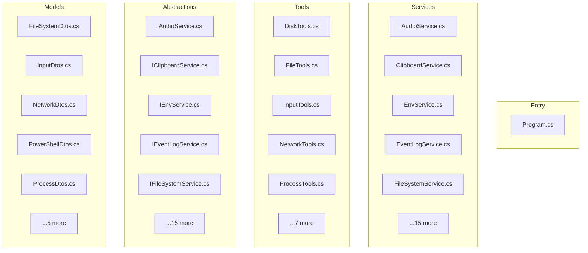

# unknown - Dependency Graph

**Version**: 0.0.0 | **Last Updated**: 2026-05-28

This document provides a comprehensive dependency graph of all files, components, imports, functions, and variables in the codebase.

---

## Table of Contents

1. [Overview](#overview)
2. [Entry Dependencies](#entry-dependencies)
3. [Services Dependencies](#services-dependencies)
4. [Tools Dependencies](#tools-dependencies)
5. [Abstractions Dependencies](#abstractions-dependencies)
6. [Models Dependencies](#models-dependencies)
7. [Dependency Matrix](#dependency-matrix)
8. [Circular Dependency Analysis](#circular-dependency-analysis)
9. [Visual Dependency Graph](#visual-dependency-graph)
10. [Summary Statistics](#summary-statistics)

---

## Overview

The codebase is organized into the following modules:

- **entry**: 1 file
- **services**: 20 files
- **tools**: 12 files
- **abstractions**: 20 files
- **models**: 10 files

---

## Entry Dependencies

### `src/WindowsMcp/Program.cs` - Program.cs module

**External Dependencies:**
| Package | Import |
|---------|--------|
| `Microsoft` | `Microsoft.Extensions.DependencyInjection, Microsoft.Extensions.Hosting, Microsoft.Extensions.Logging` |
| `ModelContextProtocol` | `ModelContextProtocol.Server` |

**Node.js Built-in Dependencies:**
| Module | Import |
|--------|--------|
| `Windows` | `Windows` |

**Internal Dependencies:**
| File | Imports | Type |
|------|---------|------|
| `WindowsMcp.Abstractions` | `WindowsMcp.Abstractions` | Import |
| `WindowsMcp.Services` | `WindowsMcp.Services` | Import |

**Exports:**
- Classes: `Program`

---

## Services Dependencies

### `src/WindowsMcp/Services/AudioService.cs` - TODO(v0.3.0): swap to NAudio/AudioDeviceCmdlets for accurate get/set

**Internal Dependencies:**
| File | Imports | Type |
|------|---------|------|
| `WindowsMcp.Abstractions` | `WindowsMcp.Abstractions` | Import |
| `WindowsMcp.Abstractions.Models` | `WindowsMcp.Abstractions.Models` | Import |

**Exports:**
- Classes: `AudioService`

---

### `src/WindowsMcp/Services/ClipboardService.cs` - ClipboardService.cs module

**Internal Dependencies:**
| File | Imports | Type |
|------|---------|------|
| `WindowsMcp.Abstractions` | `WindowsMcp.Abstractions` | Import |

**Exports:**
- Classes: `ClipboardService`

---

### `src/WindowsMcp/Services/EnvService.cs` - EnvService.cs module

**Internal Dependencies:**
| File | Imports | Type |
|------|---------|------|
| `WindowsMcp.Abstractions` | `WindowsMcp.Abstractions` | Import |

**Exports:**
- Classes: `EnvService`

---

### `src/WindowsMcp/Services/EventLogService.cs` - EventLogService.cs module

**Node.js Built-in Dependencies:**
| Module | Import |
|--------|--------|
| `System` | `System` |

**Internal Dependencies:**
| File | Imports | Type |
|------|---------|------|
| `WindowsMcp.Abstractions` | `WindowsMcp.Abstractions` | Import |
| `WindowsMcp.Abstractions.Models` | `WindowsMcp.Abstractions.Models` | Import |

**Exports:**
- Classes: `EventLogService`

---

### `src/WindowsMcp/Services/FileSystemService.cs` - FileSystemService.cs module

**Node.js Built-in Dependencies:**
| Module | Import |
|--------|--------|
| `System` | `System` |

**Internal Dependencies:**
| File | Imports | Type |
|------|---------|------|
| `WindowsMcp.Abstractions` | `WindowsMcp.Abstractions` | Import |
| `WindowsMcp.Abstractions.Models` | `WindowsMcp.Abstractions.Models` | Import |

**Exports:**
- Classes: `FileSystemService`

---

### `src/WindowsMcp/Services/InputService.cs` - Disambiguate: H.InputSimulator also exposes a WindowsInput.MouseButton enum.

**External Dependencies:**
| Package | Import |
|---------|--------|
| `WindowsInput` | `WindowsInput` |

**Node.js Built-in Dependencies:**
| Module | Import |
|--------|--------|
| `Windows` | `Windows` |

**Internal Dependencies:**
| File | Imports | Type |
|------|---------|------|
| `WindowsMcp.Abstractions` | `WindowsMcp.Abstractions` | Import |
| `WindowsMcp.Abstractions.Models` | `WindowsMcp.Abstractions.Models` | Import |

**Exports:**
- Classes: `InputService`

---

### `src/WindowsMcp/Services/NetworkService.cs` - NetworkService.cs module

**External Dependencies:**
| Package | Import |
|---------|--------|
| `Microsoft` | `Microsoft.Extensions.Logging` |

**Node.js Built-in Dependencies:**
| Module | Import |
|--------|--------|
| `System` | `System` |

**Internal Dependencies:**
| File | Imports | Type |
|------|---------|------|
| `WindowsMcp.Abstractions` | `WindowsMcp.Abstractions` | Import |
| `WindowsMcp.Abstractions.Models` | `WindowsMcp.Abstractions.Models` | Import |

**Exports:**
- Classes: `NetworkService`

---

### `src/WindowsMcp/Services/NotificationService.cs` - NotificationService.cs module

**Internal Dependencies:**
| File | Imports | Type |
|------|---------|------|
| `WindowsMcp.Abstractions` | `WindowsMcp.Abstractions` | Import |

**Exports:**
- Classes: `NotificationService`

---

### `src/WindowsMcp/Services/OcrService.cs` - OcrService.cs module

**Node.js Built-in Dependencies:**
| Module | Import |
|--------|--------|
| `System` | `System` |
| `Windows` | `Windows` |

**Internal Dependencies:**
| File | Imports | Type |
|------|---------|------|
| `WindowsMcp.Abstractions` | `WindowsMcp.Abstractions` | Import |
| `WindowsMcp.Abstractions.Models` | `WindowsMcp.Abstractions.Models` | Import |

**Exports:**
- Classes: `OcrService`

---

### `src/WindowsMcp/Services/PowerService.cs` - PowerService.cs module

**Node.js Built-in Dependencies:**
| Module | Import |
|--------|--------|
| `Windows` | `Windows` |

**Internal Dependencies:**
| File | Imports | Type |
|------|---------|------|
| `WindowsMcp.Abstractions` | `WindowsMcp.Abstractions` | Import |

**Exports:**
- Classes: `PowerService`

---

### `src/WindowsMcp/Services/PowerShellService.cs` - PowerShellService.cs module

**External Dependencies:**
| Package | Import |
|---------|--------|
| `Microsoft` | `Microsoft.Extensions.Logging` |

**Node.js Built-in Dependencies:**
| Module | Import |
|--------|--------|
| `System` | `System` |

**Internal Dependencies:**
| File | Imports | Type |
|------|---------|------|
| `WindowsMcp.Abstractions` | `WindowsMcp.Abstractions` | Import |
| `WindowsMcp.Abstractions.Models` | `WindowsMcp.Abstractions.Models` | Import |

**Exports:**
- Classes: `PowerShellService`

---

### `src/WindowsMcp/Services/ProcessService.cs` - ProcessService.cs module

**Node.js Built-in Dependencies:**
| Module | Import |
|--------|--------|
| `System` | `System` |

**Internal Dependencies:**
| File | Imports | Type |
|------|---------|------|
| `WindowsMcp.Abstractions` | `WindowsMcp.Abstractions` | Import |
| `WindowsMcp.Abstractions.Models` | `WindowsMcp.Abstractions.Models` | Import |

**Exports:**
- Classes: `ProcessService`

---

### `src/WindowsMcp/Services/RegistryService.cs` - RegistryService.cs module

**Node.js Built-in Dependencies:**
| Module | Import |
|--------|--------|
| `Microsoft` | `Microsoft` |

**Internal Dependencies:**
| File | Imports | Type |
|------|---------|------|
| `WindowsMcp.Abstractions` | `WindowsMcp.Abstractions` | Import |
| `WindowsMcp.Abstractions.Models` | `WindowsMcp.Abstractions.Models` | Import |

**Exports:**
- Classes: `RegistryService`

---

### `src/WindowsMcp/Services/ScreenshotService.cs` - ScreenshotService.cs module

**External Dependencies:**
| Package | Import |
|---------|--------|
| `SkiaSharp` | `SkiaSharp` |

**Node.js Built-in Dependencies:**
| Module | Import |
|--------|--------|
| `System` | `System` |
| `Windows` | `Windows` |

**Internal Dependencies:**
| File | Imports | Type |
|------|---------|------|
| `WindowsMcp.Abstractions` | `WindowsMcp.Abstractions` | Import |
| `WindowsMcp.Abstractions.Models` | `WindowsMcp.Abstractions.Models` | Import |

**Exports:**
- Classes: `ScreenshotService`

---

### `src/WindowsMcp/Services/ServiceControlService.cs` - ServiceControlService.cs module

**Node.js Built-in Dependencies:**
| Module | Import |
|--------|--------|
| `System` | `System` |

**Internal Dependencies:**
| File | Imports | Type |
|------|---------|------|
| `WindowsMcp.Abstractions` | `WindowsMcp.Abstractions` | Import |
| `WindowsMcp.Abstractions.Models` | `WindowsMcp.Abstractions.Models` | Import |

**Exports:**
- Classes: `ServiceControlService`

---

### `src/WindowsMcp/Services/TaskSchedulerService.cs` - Suppress ambiguous-reference: TaskScheduler library exports 'Task' which clashes with

**External Dependencies:**
| Package | Import |
|---------|--------|
| `Microsoft` | `Microsoft.Win32.TaskScheduler` |

**Internal Dependencies:**
| File | Imports | Type |
|------|---------|------|
| `WindowsMcp.Abstractions` | `WindowsMcp.Abstractions` | Import |
| `WindowsMcp.Abstractions.Models` | `WindowsMcp.Abstractions.Models` | Import |

**Exports:**
- Classes: `TaskSchedulerService`

---

### `src/WindowsMcp/Services/UIAutomationService.cs` - TODO (v0.3.0): Element cache (_elementCache) is unbounded by design in v0.2.0.

**External Dependencies:**
| Package | Import |
|---------|--------|
| `FlaUI` | `FlaUI.Core.AutomationElements, FlaUI.Core.Definitions, FlaUI.UIA3` |

**Node.js Built-in Dependencies:**
| Module | Import |
|--------|--------|
| `System` | `System` |

**Internal Dependencies:**
| File | Imports | Type |
|------|---------|------|
| `WindowsMcp.Abstractions` | `WindowsMcp.Abstractions` | Import |
| `WindowsMcp.Abstractions.Models` | `WindowsMcp.Abstractions.Models` | Import |

**Exports:**
- Classes: `UIAutomationService`

---

### `src/WindowsMcp/Services/WebService.cs` - WebService.cs module

**External Dependencies:**
| Package | Import |
|---------|--------|
| `Microsoft` | `Microsoft.Extensions.Logging` |

**Node.js Built-in Dependencies:**
| Module | Import |
|--------|--------|
| `System` | `System` |

**Internal Dependencies:**
| File | Imports | Type |
|------|---------|------|
| `WindowsMcp.Abstractions` | `WindowsMcp.Abstractions` | Import |
| `WindowsMcp.Abstractions.Models` | `WindowsMcp.Abstractions.Models` | Import |

**Exports:**
- Classes: `WebService`

---

### `src/WindowsMcp/Services/WindowService.cs` - WindowService.cs module

**Node.js Built-in Dependencies:**
| Module | Import |
|--------|--------|
| `System` | `System` |
| `Windows` | `Windows` |

**Internal Dependencies:**
| File | Imports | Type |
|------|---------|------|
| `WindowsMcp.Abstractions` | `WindowsMcp.Abstractions` | Import |
| `WindowsMcp.Abstractions.Models` | `WindowsMcp.Abstractions.Models` | Import |

**Exports:**
- Classes: `WindowService`

---

### `src/WindowsMcp/Services/WmiService.cs` - WmiService.cs module

**Node.js Built-in Dependencies:**
| Module | Import |
|--------|--------|
| `System` | `System` |

**Internal Dependencies:**
| File | Imports | Type |
|------|---------|------|
| `WindowsMcp.Abstractions` | `WindowsMcp.Abstractions` | Import |

**Exports:**
- Classes: `WmiService`

---

## Tools Dependencies

### `src/WindowsMcp/Tools/DiskTools.cs` - DiskTools.cs module

**External Dependencies:**
| Package | Import |
|---------|--------|
| `ModelContextProtocol` | `ModelContextProtocol.Server` |

**Node.js Built-in Dependencies:**
| Module | Import |
|--------|--------|
| `System` | `System` |

**Internal Dependencies:**
| File | Imports | Type |
|------|---------|------|
| `WindowsMcp.Abstractions` | `WindowsMcp.Abstractions` | Import |

**Exports:**
- Classes: `DiskTools`
- Functions: `DiskInspect`

---

### `src/WindowsMcp/Tools/FileTools.cs` - FileTools.cs module

**External Dependencies:**
| Package | Import |
|---------|--------|
| `ModelContextProtocol` | `ModelContextProtocol.Server` |

**Node.js Built-in Dependencies:**
| Module | Import |
|--------|--------|
| `System` | `System` |

**Internal Dependencies:**
| File | Imports | Type |
|------|---------|------|
| `WindowsMcp.Abstractions` | `WindowsMcp.Abstractions` | Import |

**Exports:**
- Classes: `FileTools`
- Functions: `FileSearch`, `FileManage`, `FileDialog`, `FileRead`, `FileWrite`, `FileInfo`, `Archive`

---

### `src/WindowsMcp/Tools/InputTools.cs` - InputTools.cs module

**External Dependencies:**
| Package | Import |
|---------|--------|
| `ModelContextProtocol` | `ModelContextProtocol.Server` |

**Node.js Built-in Dependencies:**
| Module | Import |
|--------|--------|
| `System` | `System` |

**Internal Dependencies:**
| File | Imports | Type |
|------|---------|------|
| `WindowsMcp.Abstractions` | `WindowsMcp.Abstractions` | Import |
| `WindowsMcp.Abstractions.Models` | `WindowsMcp.Abstractions.Models` | Import |

**Exports:**
- Classes: `InputTools`
- Functions: `Click`, `Drag`, `Hover`, `Type`, `Key`, `Shortcut`, `Scroll`, `Clipboard`

---

### `src/WindowsMcp/Tools/NetworkTools.cs` - NetworkTools.cs module

**External Dependencies:**
| Package | Import |
|---------|--------|
| `ModelContextProtocol` | `ModelContextProtocol.Server` |

**Node.js Built-in Dependencies:**
| Module | Import |
|--------|--------|
| `System` | `System` |

**Internal Dependencies:**
| File | Imports | Type |
|------|---------|------|
| `WindowsMcp.Abstractions` | `WindowsMcp.Abstractions` | Import |

**Exports:**
- Classes: `NetworkTools`
- Functions: `Network`, `Firewall`

---

### `src/WindowsMcp/Tools/ProcessTools.cs` - ProcessTools.cs module

**External Dependencies:**
| Package | Import |
|---------|--------|
| `ModelContextProtocol` | `ModelContextProtocol.Server` |

**Node.js Built-in Dependencies:**
| Module | Import |
|--------|--------|
| `System` | `System` |

**Internal Dependencies:**
| File | Imports | Type |
|------|---------|------|
| `WindowsMcp.Abstractions` | `WindowsMcp.Abstractions` | Import |

**Exports:**
- Classes: `ProcessTools`
- Functions: `Process`, `StartProcess`, `Service`, `ScheduledTask`, `EventLog`

---

### `src/WindowsMcp/Tools/RegistryTools.cs` - RegistryTools.cs module

**External Dependencies:**
| Package | Import |
|---------|--------|
| `ModelContextProtocol` | `ModelContextProtocol.Server` |

**Node.js Built-in Dependencies:**
| Module | Import |
|--------|--------|
| `System` | `System` |

**Internal Dependencies:**
| File | Imports | Type |
|------|---------|------|
| `WindowsMcp.Abstractions` | `WindowsMcp.Abstractions` | Import |

**Exports:**
- Classes: `RegistryTools`
- Functions: `RegistryGet`, `RegistrySet`

---

### `src/WindowsMcp/Tools/ScreenTools.cs` - ScreenTools.cs module

**External Dependencies:**
| Package | Import |
|---------|--------|
| `ModelContextProtocol` | `ModelContextProtocol.Server` |

**Node.js Built-in Dependencies:**
| Module | Import |
|--------|--------|
| `System` | `System` |

**Internal Dependencies:**
| File | Imports | Type |
|------|---------|------|
| `WindowsMcp.Abstractions` | `WindowsMcp.Abstractions` | Import |
| `WindowsMcp.Abstractions.Models` | `WindowsMcp.Abstractions.Models` | Import |

**Exports:**
- Classes: `ScreenTools`
- Functions: `Screenshot`, `Ocr`

---

### `src/WindowsMcp/Tools/ShellTools.cs` - ShellTools.cs module

**External Dependencies:**
| Package | Import |
|---------|--------|
| `ModelContextProtocol` | `ModelContextProtocol.Server` |

**Node.js Built-in Dependencies:**
| Module | Import |
|--------|--------|
| `System` | `System` |

**Internal Dependencies:**
| File | Imports | Type |
|------|---------|------|
| `WindowsMcp.Abstractions` | `WindowsMcp.Abstractions` | Import |

**Exports:**
- Classes: `ShellTools`
- Functions: `Powershell`

---

### `src/WindowsMcp/Tools/SystemTools.cs` - SystemTools.cs module

**External Dependencies:**
| Package | Import |
|---------|--------|
| `ModelContextProtocol` | `ModelContextProtocol.Server` |

**Node.js Built-in Dependencies:**
| Module | Import |
|--------|--------|
| `System` | `System` |

**Internal Dependencies:**
| File | Imports | Type |
|------|---------|------|
| `WindowsMcp.Abstractions` | `WindowsMcp.Abstractions` | Import |

**Exports:**
- Classes: `SystemTools`
- Functions: `SystemInfo`, `Audio`, `Notification`, `SecurityAudit`, `WmiQuery`, `Env`, `PowerAction`

---

### `src/WindowsMcp/Tools/UIAutomationTools.cs` - UIAutomationTools.cs module

**External Dependencies:**
| Package | Import |
|---------|--------|
| `ModelContextProtocol` | `ModelContextProtocol.Server` |

**Node.js Built-in Dependencies:**
| Module | Import |
|--------|--------|
| `System` | `System` |

**Internal Dependencies:**
| File | Imports | Type |
|------|---------|------|
| `WindowsMcp.Abstractions` | `WindowsMcp.Abstractions` | Import |
| `WindowsMcp.Abstractions.Models` | `WindowsMcp.Abstractions.Models` | Import |

**Exports:**
- Classes: `UIAutomationTools`
- Functions: `GetState`, `FindElement`, `GetElement`, `GetText`, `AssertElement`, `InteractElement`, `GetTable`, `WaitFor`

---

### `src/WindowsMcp/Tools/WebTools.cs` - WebTools.cs module

**External Dependencies:**
| Package | Import |
|---------|--------|
| `ModelContextProtocol` | `ModelContextProtocol.Server` |

**Node.js Built-in Dependencies:**
| Module | Import |
|--------|--------|
| `System` | `System` |

**Internal Dependencies:**
| File | Imports | Type |
|------|---------|------|
| `WindowsMcp.Abstractions` | `WindowsMcp.Abstractions` | Import |

**Exports:**
- Classes: `WebTools`
- Functions: `Scrape`, `HttpRequest`

---

### `src/WindowsMcp/Tools/WindowTools.cs` - WindowTools.cs module

**External Dependencies:**
| Package | Import |
|---------|--------|
| `ModelContextProtocol` | `ModelContextProtocol.Server` |

**Node.js Built-in Dependencies:**
| Module | Import |
|--------|--------|
| `System` | `System` |

**Internal Dependencies:**
| File | Imports | Type |
|------|---------|------|
| `WindowsMcp.Abstractions` | `WindowsMcp.Abstractions` | Import |

**Exports:**
- Classes: `WindowTools`
- Functions: `Window`, `SwitchToWindow`, `Launch`, `Focus`, `MultiMonitor`

---

## Abstractions Dependencies

### `src/WindowsMcp.Abstractions/IAudioService.cs` - Get the current playback volume level (0-100) and muted state.

**Exports:**
- Classes: `AudioState`
- Interfaces: `IAudioService`

---

### `src/WindowsMcp.Abstractions/IClipboardService.cs` - IClipboardService.cs module

**Exports:**
- Interfaces: `IClipboardService`

---

### `src/WindowsMcp.Abstractions/IEnvService.cs` - IEnvService.cs module

**Exports:**
- Interfaces: `IEnvService`

---

### `src/WindowsMcp.Abstractions/IEventLogService.cs` - IEventLogService.cs module

**Internal Dependencies:**
| File | Imports | Type |
|------|---------|------|
| `WindowsMcp.Abstractions.Models` | `WindowsMcp.Abstractions.Models` | Import |

**Exports:**
- Interfaces: `IEventLogService`

---

### `src/WindowsMcp.Abstractions/IFileSystemService.cs` - IFileSystemService.cs module

**Internal Dependencies:**
| File | Imports | Type |
|------|---------|------|
| `WindowsMcp.Abstractions.Models` | `WindowsMcp.Abstractions.Models` | Import |

**Exports:**
- Interfaces: `IFileSystemService`

---

### `src/WindowsMcp.Abstractions/IInputService.cs` - IInputService.cs module

**Internal Dependencies:**
| File | Imports | Type |
|------|---------|------|
| `WindowsMcp.Abstractions.Models` | `WindowsMcp.Abstractions.Models` | Import |

**Exports:**
- Interfaces: `IInputService`

---

### `src/WindowsMcp.Abstractions/INetworkService.cs` - INetworkService.cs module

**Internal Dependencies:**
| File | Imports | Type |
|------|---------|------|
| `WindowsMcp.Abstractions.Models` | `WindowsMcp.Abstractions.Models` | Import |

**Exports:**
- Interfaces: `INetworkService`

---

### `src/WindowsMcp.Abstractions/INotificationService.cs` - INotificationService.cs module

**Exports:**
- Interfaces: `INotificationService`

---

### `src/WindowsMcp.Abstractions/IOcrService.cs` - IOcrService.cs module

**Internal Dependencies:**
| File | Imports | Type |
|------|---------|------|
| `WindowsMcp.Abstractions.Models` | `WindowsMcp.Abstractions.Models` | Import |

**Exports:**
- Interfaces: `IOcrService`

---

### `src/WindowsMcp.Abstractions/IPowerService.cs` - IPowerService.cs module

**Exports:**
- Interfaces: `IPowerService`

---

### `src/WindowsMcp.Abstractions/IPowerShellService.cs` - IPowerShellService.cs module

**Internal Dependencies:**
| File | Imports | Type |
|------|---------|------|
| `WindowsMcp.Abstractions.Models` | `WindowsMcp.Abstractions.Models` | Import |

**Exports:**
- Interfaces: `IPowerShellService`

---

### `src/WindowsMcp.Abstractions/IProcessService.cs` - IProcessService.cs module

**Internal Dependencies:**
| File | Imports | Type |
|------|---------|------|
| `WindowsMcp.Abstractions.Models` | `WindowsMcp.Abstractions.Models` | Import |

**Exports:**
- Interfaces: `IProcessService`

---

### `src/WindowsMcp.Abstractions/IRegistryService.cs` - IRegistryService.cs module

**Internal Dependencies:**
| File | Imports | Type |
|------|---------|------|
| `WindowsMcp.Abstractions.Models` | `WindowsMcp.Abstractions.Models` | Import |

**Exports:**
- Interfaces: `IRegistryService`

---

### `src/WindowsMcp.Abstractions/IScreenshotService.cs` - IScreenshotService.cs module

**Internal Dependencies:**
| File | Imports | Type |
|------|---------|------|
| `WindowsMcp.Abstractions.Models` | `WindowsMcp.Abstractions.Models` | Import |

**Exports:**
- Interfaces: `IScreenshotService`

---

### `src/WindowsMcp.Abstractions/IServiceControlService.cs` - IServiceControlService.cs module

**Internal Dependencies:**
| File | Imports | Type |
|------|---------|------|
| `WindowsMcp.Abstractions.Models` | `WindowsMcp.Abstractions.Models` | Import |

**Exports:**
- Interfaces: `IServiceControlService`

---

### `src/WindowsMcp.Abstractions/ITaskSchedulerService.cs` - ITaskSchedulerService.cs module

**Internal Dependencies:**
| File | Imports | Type |
|------|---------|------|
| `WindowsMcp.Abstractions.Models` | `WindowsMcp.Abstractions.Models` | Import |

**Exports:**
- Interfaces: `ITaskSchedulerService`

---

### `src/WindowsMcp.Abstractions/IUIAutomationService.cs` - IUIAutomationService.cs module

**Internal Dependencies:**
| File | Imports | Type |
|------|---------|------|
| `WindowsMcp.Abstractions.Models` | `WindowsMcp.Abstractions.Models` | Import |

**Exports:**
- Interfaces: `IUIAutomationService`

---

### `src/WindowsMcp.Abstractions/IWebService.cs` - IWebService.cs module

**Internal Dependencies:**
| File | Imports | Type |
|------|---------|------|
| `WindowsMcp.Abstractions.Models` | `WindowsMcp.Abstractions.Models` | Import |

**Exports:**
- Interfaces: `IWebService`

---

### `src/WindowsMcp.Abstractions/IWindowService.cs` - IWindowService.cs module

**Internal Dependencies:**
| File | Imports | Type |
|------|---------|------|
| `WindowsMcp.Abstractions.Models` | `WindowsMcp.Abstractions.Models` | Import |

**Exports:**
- Interfaces: `IWindowService`

---

### `src/WindowsMcp.Abstractions/IWmiService.cs` - IWmiService.cs module

**Exports:**
- Interfaces: `IWmiService`

---

## Models Dependencies

### `src/WindowsMcp.Abstractions/Models/FileSystemDtos.cs` - FileSystemDtos.cs module

**Exports:**
- Classes: `FileInfoDto`, `FileSearchHit`, `RegistryValueDto`, `ServiceDto`, `EventLogEntryDto`, `ScheduledTaskDto`

---

### `src/WindowsMcp.Abstractions/Models/InputDtos.cs` - InputDtos.cs module

**Exports:**
- Classes: `ClickResult`, `DragResult`, `TypeResult`
- Enums: `MouseButton`

---

### `src/WindowsMcp.Abstractions/Models/NetworkDtos.cs` - NetworkDtos.cs module

**Exports:**
- Classes: `NetworkAdapterDto`, `PortInfoDto`, `PingResult`, `WifiInfoDto`

---

### `src/WindowsMcp.Abstractions/Models/PowerShellDtos.cs` - PowerShellDtos.cs module

**Exports:**
- Classes: `PSResult`

---

### `src/WindowsMcp.Abstractions/Models/ProcessDtos.cs` - ProcessDtos.cs module

**Exports:**
- Classes: `ProcessDto`

---

### `src/WindowsMcp.Abstractions/Models/ScreenDtos.cs` - ScreenDtos.cs module

**Exports:**
- Classes: `ScreenRegion`, `ScreenshotResult`
- Enums: `ImageFormat`

---

### `src/WindowsMcp.Abstractions/Models/SystemDtos.cs` - SystemDtos.cs module

**Exports:**
- Classes: `WmiResultDto`

---

### `src/WindowsMcp.Abstractions/Models/UIAutomationDtos.cs` - UIAutomationDtos.cs module

**Exports:**
- Classes: `ElementInfo`, `Bounds`, `ElementTree`, `FindElementResult`, `TableData`
- Enums: `FindKind`

---

### `src/WindowsMcp.Abstractions/Models/WebDtos.cs` - WebDtos.cs module

**Exports:**
- Classes: `HttpResponseDto`

---

### `src/WindowsMcp.Abstractions/Models/WindowDtos.cs` - WindowDtos.cs module

**Exports:**
- Classes: `WindowAction`, `MonitorInfo`

---

## Dependency Matrix

### File Import/Export Matrix

| File | Imports From | Exports To |
|------|--------------|------------|
| `Program.cs` | 2 files | 0 files |
| `AudioService.cs` | 2 files | 1 files |
| `ClipboardService.cs` | 1 files | 1 files |
| `EnvService.cs` | 1 files | 1 files |
| `EventLogService.cs` | 2 files | 1 files |
| `FileSystemService.cs` | 2 files | 1 files |
| `InputService.cs` | 2 files | 1 files |
| `NetworkService.cs` | 2 files | 1 files |
| `NotificationService.cs` | 1 files | 1 files |
| `OcrService.cs` | 2 files | 1 files |
| `PowerService.cs` | 1 files | 1 files |
| `PowerShellService.cs` | 2 files | 1 files |
| `ProcessService.cs` | 2 files | 1 files |
| `RegistryService.cs` | 2 files | 1 files |
| `ScreenshotService.cs` | 2 files | 1 files |
| `ServiceControlService.cs` | 2 files | 1 files |
| `TaskSchedulerService.cs` | 2 files | 1 files |
| `UIAutomationService.cs` | 2 files | 1 files |
| `WebService.cs` | 2 files | 1 files |
| `WindowService.cs` | 2 files | 1 files |
| `WmiService.cs` | 1 files | 1 files |
| `DiskTools.cs` | 1 files | 0 files |
| `FileTools.cs` | 1 files | 0 files |
| `InputTools.cs` | 2 files | 0 files |
| `NetworkTools.cs` | 1 files | 0 files |
| `ProcessTools.cs` | 1 files | 0 files |
| `RegistryTools.cs` | 1 files | 0 files |
| `ScreenTools.cs` | 2 files | 0 files |
| `ShellTools.cs` | 1 files | 0 files |
| `SystemTools.cs` | 1 files | 0 files |

---

## Circular Dependency Analysis

**No circular dependencies detected.**
---

## Visual Dependency Graph

---

## Summary Statistics

| Category | Count |
|----------|-------|
| Total Source Files | 63 |
| Total Modules | 5 |
| Total Lines of Code | 3331 |
| Total Exports | 133 |
| Total Re-exports | 0 |
| Total Classes | 60 |
| Total Interfaces | 20 |
| Total Functions | 50 |
| Total Type Guards | 0 |
| Total Enums | 3 |
| Type-only Imports | 0 |
| Runtime Circular Deps | 0 |
| Type-only Circular Deps | 0 |

---

*Last Updated*: 2026-05-28
*Version*: 0.0.0
